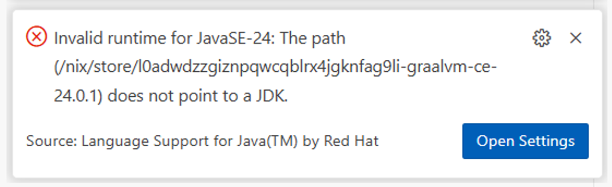

# VSCode Java/Nix Issue

## Pre-requisites

Ensure you have Nix installed on your system. I recommend using the [Determinate Nix Installer](https://github.com/DeterminateSystems/nix-installer) because it performs a clean installation and lets you uninstall everything easily and quickly after running through these examples.

```bash
curl -fsSL https://install.determinate.systems/nix | sh -s -- install --determinate
```

Also, ensure you have Visual Studio Code installed, along with the "Language Support for Java(TM) by Red Hat" extension. If you have "the Gradle for Java" extension, go ahead and disable it for now, as it creates more issues that we will not address here.

The examples can be run on Linux, macOS, or WSL2 on Windows.

## Issue #1: Nix GraalVM is not recognized by VSCode Java

### Successful Scenario with Zulu

First, navigate to the `zulu24` directory:

```bash
cd zulu24
```

Then, run the following command to activate the Nix environment:

```bash
nix develop
```

Open the project in Visual Studio Code from within the Nix environment:

```bash
code .
```

Verify the current Java version is the one from the Nix environment:

```bash
which java
```

You should see a path similar to `/nix/store/...-zulu-24-jdk/bin/java`, indicating that the Zulu JDK is being used.

Open the `src/main/java/com/example/demo/DemoApplication.java` file. Make sure the extensions in Visual Studio Code are propertly initialized and then run the application using the "Run Java" command showing right above the main method in the `DemoApplication.java` file.

The application starts successfully, and you should see the output in the terminal.

Now stop the application, exit the Nix environment, and navigate back to the root directory:

```bash
exit
cd ../
```

Make sure you completely exit Visual Studio Code before proceeding to the next step.

### Failing Scenario with GraalVM

First, navigate to the `graalvm` directory:

```bash
cd graalvm-ce
```

Then, run the following command to activate the Nix environment:

```bash
nix develop
```

Open the project in Visual Studio Code from within the Nix environment:

```bash
code .
```

Verify the current Java version is the one from the Nix environment:

```bash
which java
```

You should see a path similar to `/nix/store/...-graalvm-ce-24.0.1/bin/java`, indicating that the GraalVM CE JDK is being used.

Open the `src/main/java/com/example/demo/DemoApplication.java` file. Make sure the extensions in Visual Studio Code are properly initialized and then run the application using the "Run Java" command showing right above the main method in the `DemoApplication.java` file.

The application fails to start, and you should see an error in the terminal indicating compilation issues. The extension does not seem to recognize the GraalVM JDK correctly, leading to compilation errors.



Make sure you completely exit Visual Studio Code before proceeding to the next step.

Now exit the Nix environment, and navigate back to the root directory:

```bash
exit
cd ../
```

## Issue #2: VSCode Java overwrites the JAVA_HOME environment variable with SDKMAN!

First, navigate to the `zulu24` directory:

```bash
cd zulu24
```

Then, run the following command to activate the Nix environment:

```bash
nix develop
```

Print the current JAVA_HOME environment variable:

```bash
echo $JAVA_HOME
``` 

You should see a path similar to `/nix/store/...-zulu-24-jdk`, indicating that the Zulu JDK is being used.

Open the project in Visual Studio Code from within the Nix environment:

```bash
code .
```

Print again the current JAVA_HOME environment variable:

```bash
echo $JAVA_HOME
```

This time, you should see a path similar to `/home/your-username/.sdkman/candidates/java/current`, indicating that the JAVA_HOME environment variable has been overwritten by the SDKMAN! installation, but only from Visual Studio Code when the Java extension is activated. Notice that there is no `.sdkmanrc` file in the Java project directory.

Where is that setting coming from? Can it be configured?

Now exit the Nix environment, and navigate back to the root directory:

```bash
exit
cd ../
```

## Clean-up

You can completely uninstall Nix as follows, assuming you used the Determinate Nix Installer as recommended in the pre-requisites:

```bash
/nix/nix-installer uninstall
```
